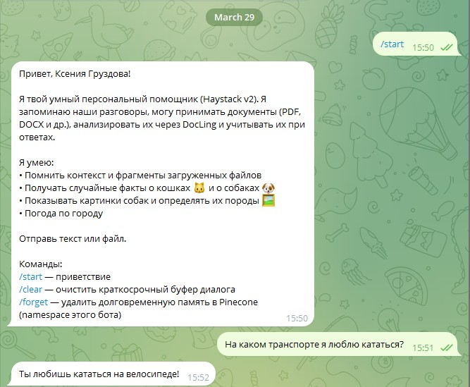
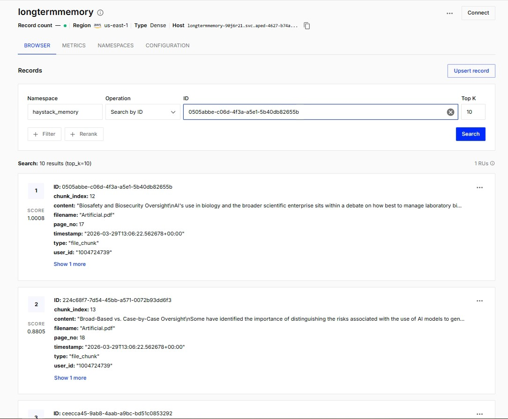
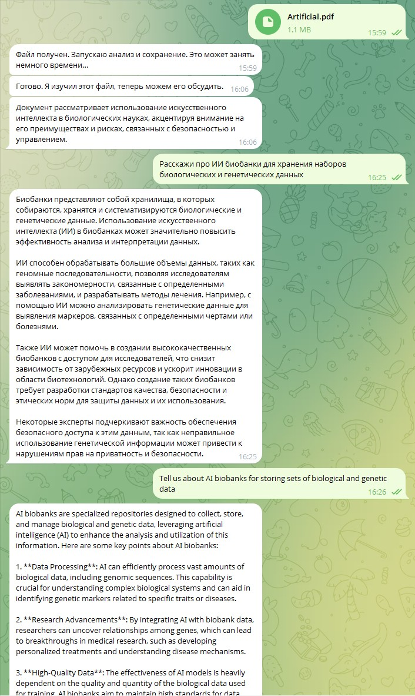
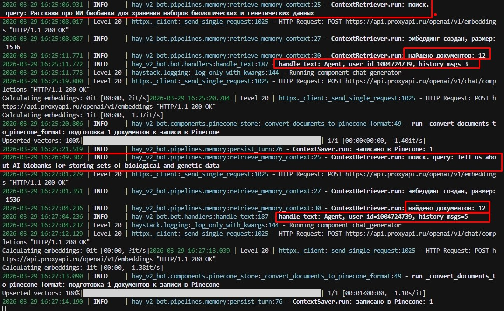
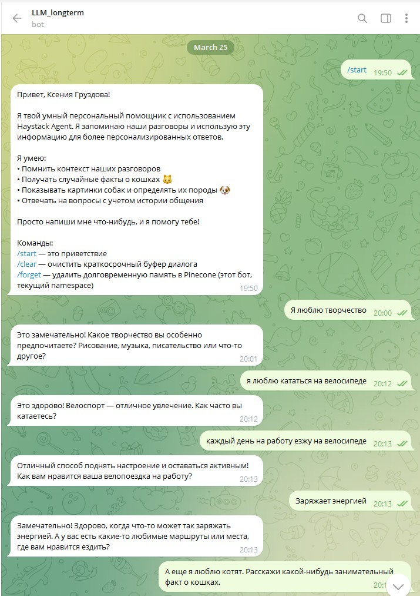

# DiologBotMemory

## Краткое описание

**DiologBotMemory** — проект на Python для экспериментов с **диалогом в Telegram** и **долговременной семантической памятью** в [Pinecone](https://www.pinecone.io/): бот запоминает реплики пользователя (и во второй версии — фрагменты загруженных документов), а при следующих сообщениях подмешивает релевантный контекст в ответы LLM. Зачем это нужно: проверять сценарии RAG-памяти, изоляцию пользователей по `user_id`, работу через **прокси OpenAI-совместимого API** (например [ProxyAPI](https://proxyapi.ru/)) и оркестрацию на **Haystack**.

В репозитории три независимых точки входа:

| Точка входа | Назначение |
|-------------|------------|
| `bot.py` | Классический диалог: OpenAI + собственный `PineconeManager`, дедупликация при записи |
| `hay/hay-telegram-bot.py` | **Haystack Agent** + `pinecone-haystack`, инструменты, в Pinecone пишутся только **тексты сообщений пользователя** |
| `hay_v2_bot/main.py` | Модульная версия: тот же агент и память + **DocLing** (PDF, DOCX и др.), чанки в Pinecone, краткое резюме после загрузки файла |

## Использованные технологии

| Категория | Инструменты и сервисы |
|-----------|------------------------|
| Язык | Python 3.10+ (для **DocLing** рекомендуется 3.11–3.12; см. документацию [docling](https://github.com/docling-project/docling)) |
| Telegram | [pyTelegramBotAPI](https://github.com/eternnoir/pyTelegramBotAPI) |
| LLM / vision | OpenAI-совместимый API (`CHAT_MODEL`, по умолчанию `gpt-4o-mini`); **`OPENAI_BASE_URL` обязателен** для `hay_v2_bot` (прокси, например `https://api.proxyapi.ru/openai/v1`) |
| Эмбеддинги | Только через API: `text-embedding-3-small` (`EMBEDDING_MODEL`), размерность `PINECONE_DIMENSION` (часто 1536) |
| Парсинг документов | [DocLing](https://github.com/docling-project/docling), для границ чанков — **tiktoken** (без локальных sentence-transformers для эмбеддингов) |
| Векторная БД | [Pinecone](https://www.pinecone.io/) |
| Оркестрация | [Haystack](https://haystack.deepset.ai/) (`haystack-ai`), [pinecone-haystack](https://haystack.deepset.ai/integrations/pinecone-document-store) |
| Логирование (Haystack-боты) | [loguru](https://github.com/Delgan/loguru) |
| HTTP к инструментам | `requests` (catfact.ninja, dog.ceo, kinduff, OpenWeather и др.) |
| Конфигурация | `python-dotenv` (файл `.env` в корне проекта) |

## Реализованный функционал

### Общее для ботов

- Диалог в Telegram с ответами от языковой модели.
- **Изоляция пользователей** по `user_id` в метаданных Pinecone.
- Базовые команды: **`/start`**, **`/clear`**, **`/forget`** (см. раздел ниже).

### `bot.py`

- Краткосрочная память и долговременная через `PineconeManager`.
- **Дедупликация** перед upsert (порог косинусного сходства в `pinecone_manager.py`).

### `hay/hay-telegram-bot.py`

- **Haystack Agent** с инструментами: факты о кошках/собаках, случайное фото собаки, **vision** (описание породы по фото), погода по городу (OpenWeather).
- Долговременная память: только **сообщения пользователя** в выбранном namespace Pinecone; краткосрочная — `deque` с `ChatMessage`.

### `hay_v2_bot` (модульная архитектура)

- Повторяет возможности Haystack-бота v1 (агент, инструменты, память сообщений).
- Загрузка **документов** в Telegram: разбор через **DocLing**, чанки с метаданными (имя файла, индекс чанка, страница при наличии), векторизация через **OpenAI** и запись в **Pinecone**.
- После успешной индексации — короткое **резюме файла** одним предложением (через тот же OpenAI-совместимый API).
- Последующие текстовые запросы учитывают и память сообщений, и фрагменты файлов через **retriever** и системный промпт.

## Инструкция по запуску

**1.** Клонировать репозиторий и создать виртуальное окружение:

```bash
python -m venv venv
venv\Scripts\activate
# Linux / macOS: source venv/bin/activate
```

**2.** Установить зависимости:

```bash
pip install -r requirements.txt
```

Для возможностей **hay_v2_bot** (DocLing и др.) дополнительно:

```bash
pip install -r hay_v2_bot/requirements.txt
```

**3.** Создать файл **`.env`** в **корне проекта** (рядом с `README.md`). Пример:

```env
PINECONE_API_KEY=ваш_ключ
PINECONE_INDEX_NAME=название_индекса
OPENAI_API_KEY=ваш_ключ
OPENAI_BASE_URL=https://api.proxyapi.ru/openai/v1
TELEGRAM_BOT_TOKEN=токен_от_BotFather
CHAT_MODEL=gpt-4o-mini
EMBEDDING_MODEL=text-embedding-3-small
PINECONE_DIMENSION=1536
HAYSTACK_PINECONE_NAMESPACE=haystack_memory
```

Для погоды (инструмент `weatherTool`):

```env
OPENWEATHER_API_KEY=ваш_ключ
```

Размерность индекса Pinecone должна совпадать с размерностью эмбеддингов.

**4.** Запуск нужной версии бота из **корня проекта**:

| Команда | Описание |
|---------|----------|
| `python bot.py` | Классический бот с `PineconeManager` |
| `python hay/hay-telegram-bot.py` | Haystack Agent v1 |
| `python hay_v2_bot/main.py` | Haystack + DocLing + файлы (v2) |

Опционально: `python pinecone_manager.py` — проверки/утилиты Pinecone из модуля менеджера.

## Доступы

| Ресурс | Как получить доступ |
|--------|----------------------|
| **Код** | Локальный клон репозитория; каталог проекта на вашей машине |
| **Telegram-бот** | Создайте бота через [@BotFather](https://t.me/BotFather), укажите `TELEGRAM_BOT_TOKEN` в `.env`. Ссылка на чат: `https://t.me/<username_вашего_бота>` |
| **Pinecone** | [Pinecone Console](https://app.pinecone.io/) — API-ключ, индекс, namespace |
| **OpenAI / прокси** | Ключ и **`OPENAI_BASE_URL`** провайдера (например ProxyAPI) |

> Не коммитьте `.env` с реальными ключами в публичный репозиторий.

## API или команды бота

Отдельного HTTP REST API в проекте **нет**: взаимодействие только через **Telegram**.

### Команды (все версии ботов)

| Команда | Действие |
|---------|----------|
| `/start` | Приветствие и краткая справка по возможностям |
| `/clear` | Очистить краткосрочный буфер диалога в памяти процесса |
| `/forget` | Удалить долговременную память текущего пользователя в Pinecone (записи с данным `user_id` в namespace `HAYSTACK_PINECONE_NAMESPACE` у Haystack-ботов) |

### Сообщения без слеша

| Действие пользователя | Что происходит |
|----------------------|----------------|
| Обычный текст | Запрос к LLM с учётом релевантного контекста из Pinecone (и инструментов агента в версиях Haystack) |
| Отправка **документа** (файл) | Только в **`hay_v2_bot`**: скачивание файла → DocLing → чанки → эмбеддинги в Pinecone → сообщение об успехе и краткое резюме |

### Внешние API, вызываемые инструментами Haystack-ботов

| Инструмент | Сервис | Назначение |
|------------|--------|------------|
| `catFactTool` | `https://catfact.ninja/fact` | Случайный факт о кошках |
| `dogImageTool` | `https://dog.ceo/api/breeds/image/random` | URL случайного изображения собаки |
| `dogFactTool` | `https://dog-api.kinduff.com/api/facts` | Случайный факт о собаках |
| `docImageAnalyzerTool` | Dog CEO + **OpenAI Chat Completions** (vision) через ваш `OPENAI_BASE_URL` | Случайное фото собаки и описание породы |
| `weatherTool` | [OpenWeather Current Weather](https://openweathermap.org/current) | Текущая погода по городу (`OPENWEATHER_API_KEY`) |

## Статус проекта

**В разработке.** Работают все три сценария (`bot.py`, `hay/hay-telegram-bot.py`, `hay_v2_bot`); v2 расширяет функционал загрузкой документов и DocLing.

**Возможные доработки:** унификация entrypoint, тесты и CI, доработка промптов и инструментов, документация по миграции данных между namespace Pinecone, дополнительные форматы или политики хранения файлов.

## Скриншоты ключевых экранов

Разместите изображения в каталоге `screenshots/` в корне проекта (пути ниже — ожидаемые имена файлов; при отсутствии файлов картинки в README не отобразятся).


### Приветствие бота hay_v2_bot (`/start`)



### Создание индекса в Pinecone hay_v2_bot



### Диалог с ботом hay_v2_bot



### Логирование в терминале (инструменты) hay_v2_bot




### Приветствие бота (`/start`) v1



### Создание индекса в Pinecone


### Диалог с ботом


### Запрос погоды


### Логирование в терминале (инструменты)


*При желании добавьте отдельно скриншоты загрузки PDF/DOCX и ответа бота после индексации для ветки `hay_v2_bot`.*
